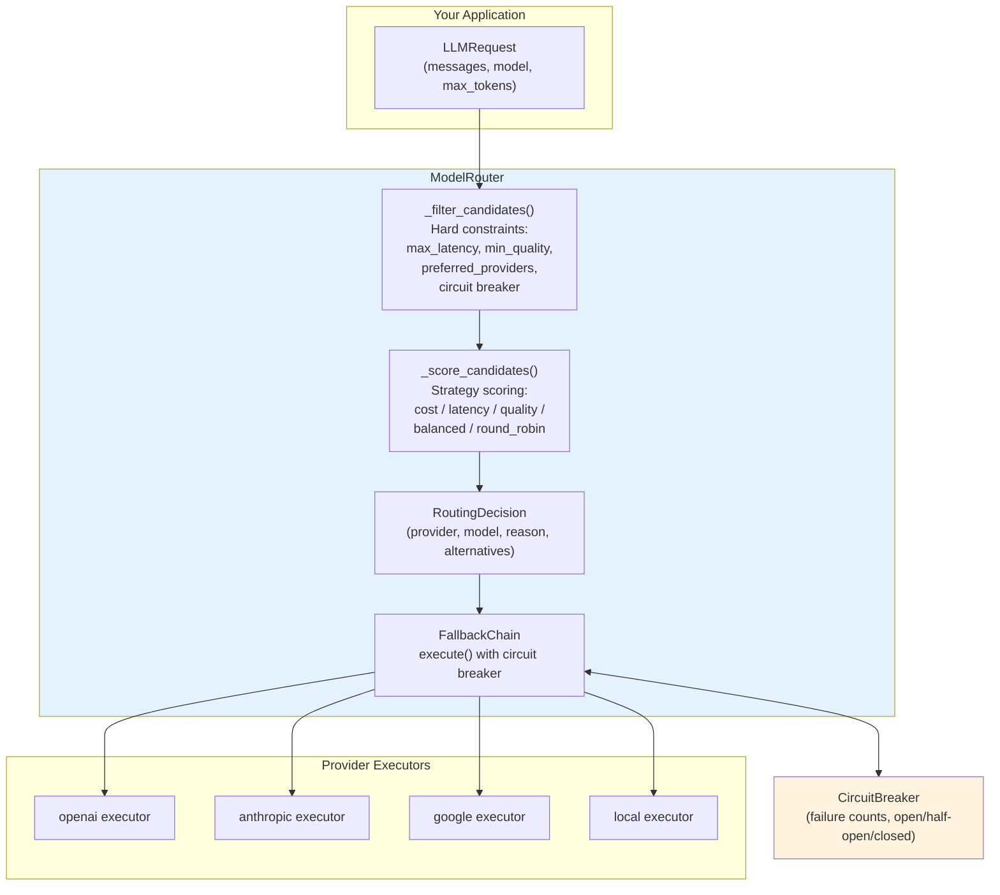

# aumai-modelrouter

> Intelligent routing of LLM requests across providers. Cost, latency, and quality-based routing with automatic failover.

[](https://github.com/aumai/aumai-modelrouter/actions)
[](https://pypi.org/project/aumai-modelrouter/)
[](https://www.python.org/)
[](LICENSE)
[](https://github.com/aumai)

---

## What is this?

Imagine you need to ship a package across the country. You have several options: overnight courier (fast, expensive), ground shipping (cheap, slow), and a regional carrier that's great for certain states. A smart logistics system would look at your package size, delivery deadline, and budget and pick the best carrier automatically — and if that carrier's website goes down, it would fall back to the next best option without you having to do anything.

**aumai-modelrouter** does the same for LLM API calls.

When you call an AI model, you typically hardcode which provider to use. That means:
- If OpenAI has an outage, your app breaks
- If Anthropic charges $15/million tokens for a task that only needs $0.50/million tokens, you're paying 30x too much
- If you add a new provider later, every call site in your code needs to change

aumai-modelrouter sits between your application and the LLM providers. You describe your provider options (OpenAI, Anthropic, Google, Azure, Bedrock, local models) along with their cost, latency, and quality characteristics. You declare a routing policy (optimize for cost? minimize latency? maximize quality? balanced?). The router picks the best provider for each request, and if that provider fails, it automatically tries the next one.

---

## Why does this matter?

### The problem from first principles

Every LLM API call has three competing dimensions:

- **Cost** — how much does this call cost in dollars?
- **Latency** — how long does it take to get a response?
- **Quality** — how capable is this model at the task?

Different tasks have different requirements. A background document summarization job cares about cost. A real-time user-facing chat cares about latency. A one-shot reasoning task cares about quality.

No single provider is optimal across all three dimensions for all tasks. GPT-4o has high quality but higher cost than GPT-4o-mini. Claude Haiku is extremely fast and cheap for simple tasks. A local Ollama model has zero cost but higher latency.

Without a router, you either:

1. Hardcode the most expensive provider everywhere (pays for quality you don't always need), or
2. Write conditional logic scattered across your codebase to pick the right provider for each use case (unmaintainable as your provider lineup evolves).

A routing layer with declarative policies solves both problems. You express *what you want* (cost-optimized, or latency under 300ms, or minimum quality 0.85) and the router figures out *which provider* delivers it.

### Fault tolerance by default

Providers fail. APIs return 429 rate-limit errors. Networks have blips. Without a fallback mechanism, these transient failures surface as errors in your application.

aumai-modelrouter includes a **circuit breaker** that tracks consecutive failures per provider and automatically stops routing to a provider that has tripped its threshold. After a configurable recovery timeout, the circuit transitions to half-open and allows one probe request through. If the probe succeeds, the circuit closes; if it fails, the timeout resets.

---

## Architecture



The routing pipeline:

1. **Filter** — `_filter_candidates()` removes any provider that violates hard constraints: circuit is open, latency above `max_latency_ms`, quality below `min_quality`, not in `preferred_providers`.
2. **Score** — `_score_candidates()` assigns a score to each remaining candidate based on the routing strategy.
3. **Select** — The highest-scoring provider becomes the primary, the rest become alternatives.
4. **Execute** — `FallbackChain` attempts the primary provider. On failure, it tries each fallback provider in order. The circuit breaker records successes and failures.

---

## Features

| Feature | Description |
|---------|-------------|
| Six routing strategies | `cost_optimized`, `latency_optimized`, `quality_optimized`, `balanced`, `round_robin`, `fallback_chain` |
| Hard constraints | Filter by `max_latency_ms`, `min_quality`, `preferred_providers` before scoring |
| Automatic failover | `FallbackChain` tries providers in order on failure |
| Circuit breaker | Stops routing to broken providers; recovers automatically after timeout |
| Thread-safe round-robin | Atomic counter with lock for concurrent request routing |
| Pluggable executors | Attach any callable as a provider executor; factory pattern supported |
| YAML and JSON config | Load router configuration from file |
| Cost telemetry | `LLMResponse` includes `cost_usd`, `tokens_input`, `tokens_output`, `latency_ms` |
| Routing transparency | `RoutingDecision` includes the reason string and ranked alternatives |
| MockProvider included | Deterministic test provider with configurable failures |
| CLI included | `modelrouter route`, `modelrouter execute`, `modelrouter providers` commands |

---

## Quick Start

### Install

```bash
pip install aumai-modelrouter
```

### Your first routing decision (under 5 minutes)

Create a config file `router.json`:

```json
{
  "providers": [
    {
      "provider": "openai",
      "models": ["gpt-4o", "gpt-4o-mini"],
      "avg_latency_ms": 800,
      "quality_score": 0.95,
      "cost_per_1k_input": 0.0025,
      "cost_per_1k_output": 0.01
    },
    {
      "provider": "anthropic",
      "models": ["claude-3-5-sonnet-20241022"],
      "avg_latency_ms": 1000,
      "quality_score": 0.93,
      "cost_per_1k_input": 0.003,
      "cost_per_1k_output": 0.015
    }
  ],
  "policy": {
    "strategy": "balanced"
  }
}
```

Create a request file `request.json`:

```json
{
  "messages": [
    { "role": "user", "content": "What is the capital of France?" }
  ],
  "max_tokens": 100
}
```

See which provider the router would select:

```bash
modelrouter route --config router.json --request request.json
```

Output:

```
Provider : openai
Model    : gpt-4o
Reason   : Selected 'openai' via strategy='balanced' with score=0.8734 (latency=800ms, quality=0.95, cost_in=$0.0025/1k).
Alternatives:
  - anthropic / claude-3-5-sonnet-20241022 (score=0.8521)
```

---

## CLI Reference

### `modelrouter route`

Show the routing decision for a request without executing it.

```
Usage: modelrouter route [OPTIONS]

Options:
  --config PATH        Path to router config (YAML or JSON).  [required]
  --request PATH       Path to LLM request JSON file.  [required]
  --json-output        Emit result as JSON.
  --help               Show help and exit.
```

**Examples:**

```bash
# Human-readable output
modelrouter route --config router.json --request request.json

# JSON output for scripting
modelrouter route --config router.json --request request.json --json-output
```

---

### `modelrouter execute`

Route and execute a prompt, printing the response content.

```
Usage: modelrouter execute [OPTIONS]

Options:
  --config PATH        Path to router config (YAML or JSON).  [required]
  --prompt TEXT        User prompt to send.  [required]
  --model TEXT         Override model selection.
  --max-tokens INT     Max output tokens.  [default: 1024]
  --json-output        Emit result as JSON (includes telemetry).
  --help               Show help and exit.
```

**Examples:**

```bash
# Execute a prompt
modelrouter execute --config router.json --prompt "Summarize quantum entanglement in one sentence."

# Execute with model override and JSON telemetry
modelrouter execute \
  --config router.json \
  --prompt "Hello" \
  --model gpt-4o-mini \
  --json-output
```

Output with `--json-output`:

```json
{
  "content": "Hello! How can I help you today?",
  "model": "gpt-4o-mini",
  "provider": "openai",
  "tokens_input": 10,
  "tokens_output": 9,
  "cost_usd": 0.000001,
  "latency_ms": 342.0,
  "cached": false
}
```

---

### `modelrouter providers`

List all configured providers and their capabilities.

```
Usage: modelrouter providers [OPTIONS]

Options:
  --config PATH        Path to router config (YAML or JSON).  [required]
  --json-output        Emit result as JSON.
  --help               Show help and exit.
```

**Examples:**

```bash
modelrouter providers --config router.json

# Output:
# Provider : openai
#   Models   : gpt-4o, gpt-4o-mini
#   Quality  : 0.95
#   Latency  : 800.0 ms
#   Cost     : $0.0025/1k in  |  $0.01/1k out
#
# Provider : anthropic
#   Models   : claude-3-5-sonnet-20241022
#   Quality  : 0.93
#   Latency  : 1000.0 ms
#   Cost     : $0.003/1k in  |  $0.015/1k out
```

---

## Python API Examples

### Basic routing

```python
from aumai_modelrouter.core import ModelRouter
from aumai_modelrouter.models import (
    LLMRequest, Provider, ProviderConfig, RoutingPolicy, RoutingStrategy
)

providers = [
    ProviderConfig(
        provider=Provider.openai,
        models=["gpt-4o", "gpt-4o-mini"],
        avg_latency_ms=800,
        quality_score=0.95,
        cost_per_1k_input=0.0025,
        cost_per_1k_output=0.01,
    ),
    ProviderConfig(
        provider=Provider.anthropic,
        models=["claude-3-5-sonnet-20241022"],
        avg_latency_ms=1000,
        quality_score=0.93,
        cost_per_1k_input=0.003,
        cost_per_1k_output=0.015,
    ),
]

policy = RoutingPolicy(strategy=RoutingStrategy.balanced)
router = ModelRouter(providers=providers, policy=policy)

request = LLMRequest(
    messages=[{"role": "user", "content": "Hello, world!"}],
    max_tokens=256,
)

decision = router.route(request)
print(f"Provider : {decision.selected_provider.value}")
print(f"Model    : {decision.selected_model}")
print(f"Reason   : {decision.reason}")
```

### Registering executors and executing requests

```python
from aumai_modelrouter.core import ModelRouter
from aumai_modelrouter.models import LLMRequest, LLMResponse, Provider

# Register a callable for each provider
def my_openai_executor(request: LLMRequest) -> LLMResponse:
    # Call the OpenAI API here
    return LLMResponse(
        content="The response content",
        model="gpt-4o",
        provider=Provider.openai,
        tokens_input=50,
        tokens_output=20,
        cost_usd=0.00015,
        latency_ms=750.0,
    )

router.register_executor(Provider.openai, my_openai_executor)

response = router.execute(request)
print(response.content)
print(f"Cost: ${response.cost_usd:.6f}")
```

### Using MockProvider for testing

```python
from aumai_modelrouter.providers.mock import MockProvider
from aumai_modelrouter.core import ModelRouter
from aumai_modelrouter.models import Provider, ProviderConfig, RoutingPolicy

config = ProviderConfig(
    provider=Provider.openai,
    models=["gpt-4o"],
    avg_latency_ms=200,
    quality_score=0.95,
)

mock = MockProvider(config, response_content="Test response.", simulated_latency_ms=200.0)
router = ModelRouter(providers=[config], policy=RoutingPolicy())
router.register_executor(Provider.openai, mock.complete)

response = router.execute(request)
print(response.content)      # "Test response."
print(mock.call_count)       # 1
```

### Cost-optimized strategy

```python
policy = RoutingPolicy(strategy=RoutingStrategy.cost_optimized)
router = ModelRouter(providers=providers, policy=policy)

decision = router.route(request)
# Selects the cheapest provider for this request's token count
```

### Latency-constrained routing

```python
policy = RoutingPolicy(
    strategy=RoutingStrategy.latency_optimized,
    max_latency_ms=500.0,  # Hard constraint: exclude providers over 500ms
)
router = ModelRouter(providers=providers, policy=policy)
```

### Routing with fallback providers

```python
policy = RoutingPolicy(
    strategy=RoutingStrategy.balanced,
    fallback_providers=[Provider.anthropic, Provider.google],
)
router = ModelRouter(providers=providers, policy=policy)

# If the primary provider fails, automatically tries anthropic, then google
response = router.execute(request)
```

---

## Configuration Options

### ProviderConfig fields

| Field | Type | Default | Description |
|-------|------|---------|-------------|
| `provider` | `Provider` | required | Provider enum: openai, anthropic, google, local, azure, bedrock |
| `api_base` | `str \| None` | `None` | Custom API base URL (for Azure, local, etc.) |
| `models` | `list[str]` | required | At least one model must be declared |
| `max_rpm` | `int` | `60` | Max requests per minute |
| `max_tpm` | `int` | `100000` | Max tokens per minute |
| `cost_per_1k_input` | `float` | `0.0` | Cost in USD per 1,000 input tokens |
| `cost_per_1k_output` | `float` | `0.0` | Cost in USD per 1,000 output tokens |
| `avg_latency_ms` | `float` | `500.0` | Average response latency in milliseconds |
| `quality_score` | `float` | `0.8` | Quality score in [0.0, 1.0] — higher is better |
| `api_key` | `SecretStr \| None` | `None` | API key (stored as Pydantic SecretStr) |

### RoutingPolicy fields

| Field | Type | Default | Description |
|-------|------|---------|-------------|
| `strategy` | `RoutingStrategy` | `balanced` | Selection algorithm |
| `max_cost_per_request` | `float \| None` | `None` | Hard cost ceiling per request in USD |
| `max_latency_ms` | `float \| None` | `None` | Hard latency ceiling — excludes providers above this |
| `min_quality` | `float \| None` | `None` | Hard quality floor — excludes providers below this |
| `preferred_providers` | `list[Provider] \| None` | `None` | If set, only route to providers in this list |
| `fallback_providers` | `list[Provider] \| None` | `None` | Ordered list of fallback providers for automatic failover |

### Routing strategies

| Strategy | Description |
|----------|-------------|
| `balanced` | Weighted average of cost, latency, and quality scores (1/3 each) |
| `cost_optimized` | Maximizes the normalized cost score — picks cheapest for estimated token count |
| `latency_optimized` | Maximizes the normalized latency score — picks fastest |
| `quality_optimized` | Uses `quality_score` directly — picks highest quality |
| `round_robin` | Rotates through candidates in order; thread-safe atomic counter |
| `fallback_chain` | Uses declared provider order as the priority (no scoring) |

---

## How it works (technical deep-dive)

### Scoring functions

All scoring functions return values in `[0.0, 1.0]` where higher is better:

- **`score_cost(provider, request)`** — Estimates total tokens from message length and `max_tokens`, then computes total cost. Normalizes against a $10/1k ceiling.
- **`score_latency(provider)`** — `1 - (avg_latency_ms / 10_000)`. Normalizes against a 10,000ms ceiling.
- **`score_quality(provider)`** — Returns `quality_score` directly (already in [0,1]).
- **`score_balanced(provider, request, weights=(1/3, 1/3, 1/3))`** — Weighted linear combination of all three. Weights need not sum to 1; they are normalized internally.

### Circuit breaker state machine

The `CircuitBreaker` tracks state per-provider:

```
Closed (normal)
  │ failure_threshold consecutive failures
  ▼
Open (blocked)
  │ recovery_timeout_seconds elapsed
  ▼
Half-open (probe allowed)
  │ success        │ failure
  ▼                ▼
Closed          Open (timeout reset)
```

Default threshold: 3 failures. Default recovery timeout: 60 seconds.

### Fallback chain execution

`FallbackChain.execute()` iterates `(provider, executor)` pairs in order:
1. Check the circuit breaker for the current provider. If open, skip.
2. Call `executor(request)`.
3. On success: call `circuit_breaker.record_success(provider)`, return the response.
4. On failure: call `circuit_breaker.record_failure(provider)`, move to the next executor.
5. If all executors are exhausted: raise `ProviderUnavailableError`.

### Thread safety

`ModelRouter` is thread-safe for the `round_robin` strategy via a `threading.Lock` that guards the rotation counter. All other strategies are stateless with respect to request routing and require no locking.

---

## Integration with other AumAI projects

| Project | Integration |
|---------|-------------|
| **aumai-toolcanon** | Tool capability metadata (`cost_estimate`, `side_effects`) can be mapped to routing policy selection — e.g., route write-side-effect tools to providers with audit logging |
| **aumai-agentruntime** | ModelRouter is the LLM dispatch layer inside the agent runtime |
| **aumai-rateguard** | Rate limiting decisions from rateguard can be fed as `max_rpm`/`max_tpm` constraints on `ProviderConfig` |

---

## Contributing

Contributions are welcome. Please read `CONTRIBUTING.md` before opening a pull request.

```bash
pip install -e ".[dev]"
pytest
ruff check src tests
mypy src
```

---

## License

Apache License 2.0 — see [LICENSE](LICENSE).

Copyright (c) 2025 AumAI Contributors.
